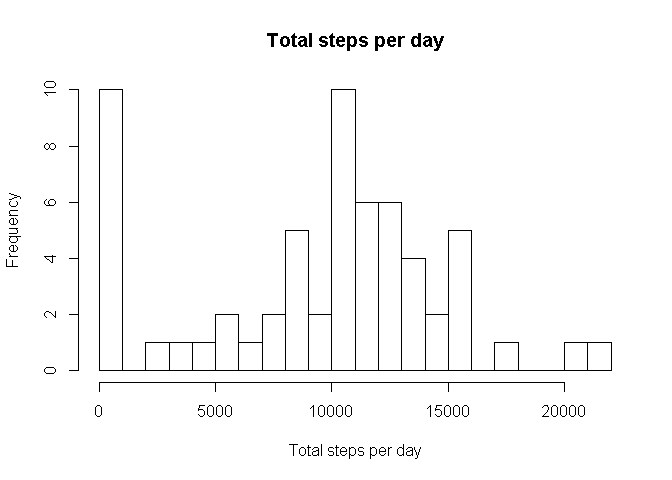

## Loading and preprocessing the data
First, we're going to unzip and read the data.

```r
unzip("activity.zip")
data = read.csv("activity.csv")
```


## What is mean total number of steps taken per day?
Let's take a look at a histogram of the total number of steps taken each day:  

```r
sum_dates=tapply(data$steps,data$date,function(x){sum(x,na.rm=TRUE)})
hist(sum_dates,breaks=20,main="Total steps per day",xlab="Total steps per day")
```

<!-- -->

We'll then calculate the mean of the total number of steps taken each day:

```r
mean(sum_dates,na.rm=TRUE)
```

```
## [1] 9354.23
```
And the median:

```r
median(sum_dates,na.rm=TRUE)
```

```
## [1] 10395
```

## What is the average daily activity pattern?
Let's plot a graph of all the 5-minute intervals, averaged over all the days.

```r
avg_intervals=tapply(data$steps,data$interval,function(x){mean(x,na.rm=TRUE)})
plot(names(avg_intervals),avg_intervals,type="l",main="Average number of steps throughout day",xlab="Time (min)",ylab="Average number of steps")
```

<!-- -->

```r
avg_max=max(avg_intervals)
avg_max_index=names(avg_intervals)[avg_intervals==avg_max]
```
We can see that the maximum is at minute 835 with an average of 206.1698113 steps.

## Imputing missing values
In some of the rows, the number of steps is NA. We can first count how many there are out of a total of 17568 rows:

```r
sum(is.na(data$steps))
```

```
## [1] 2304
```
To take care of the NA values, we're going to replace them with the average number of steps for that interval, as calculated in avg_intervals in the last section:

```r
data[is.na(data$steps),1]<-avg_intervals[as.character(data[is.na(data$steps),3])]
```

Now let's repeat the steps we did earlier when looking at the total number of steps per day. First the histogram:

```r
sum_dates=tapply(data$steps,data$date,sum)
hist(sum_dates,breaks=20,main="Total steps per day",xlab="Total steps per day")
```

<!-- -->

Then the mean:

```r
mean(sum_dates)
```

```
## [1] 10766.19
```
And the median:

```r
median(sum_dates)
```

```
## [1] 10766.19
```

It looks like there's a pretty substantial difference. The peak is larger now, with fewer 0-step days.And both the mean and the median are higher than before, which can be expected since we are adding new values to the dataset.

## Are there differences in activity patterns between weekdays and weekends?
Let's add a new column to our dataset, "day", which will be "weekday" or "weekend" depending on the date.

```r
days = c(rep("weekday",5),rep("weekend",2))
names(days)<-c("Monday","Tuesday","Wednesday","Thursday","Friday","Saturday","Sunday")
data=data.frame(data,day=days[weekdays(as.Date(data$date))])
```

Then we can plot the averages over each time interval, split into weekend and weekday:

```r
avg_weekday=tapply(data[data$day=="weekday",1],data[data$day=="weekday",3],mean)
avg_weekend=tapply(data[data$day=="weekend",1],data[data$day=="weekend",3],mean)
par(mfcol=c(2,1))
plot(names(avg_weekend),avg_weekend,type="l",main="Weekend Averages",xlab="Interval (min)",ylab="Average number of steps")
plot(names(avg_weekday),avg_weekday,type="l",main="Weekday Averages",xlab="Interval (min)",ylab="Average number of steps")
```

<!-- -->

We can see that there's less overall activity during the weekdays, and on the weekends this person is probably waking later and sleeping later. On the weekend there are frequent spikes throughout the day, where on the weekdays there's mostly one large spike around minute 800.

